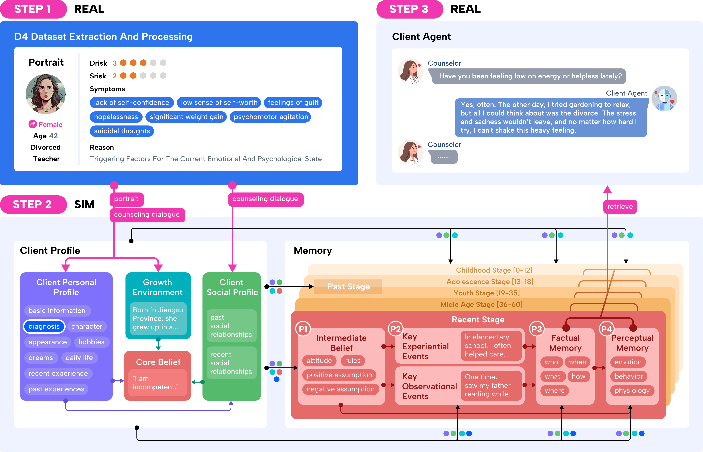

# An LLM-based Simulation Framework for Embodied Conversational Agents in Psychological Counseling
[]() []() [](https://www.python.org/downloads/release/python-3109/)

<div style="width: 100%;">
  </img>
</div>

## 📌 Table of Contents
- [Data Structure](#data-structure)
- [Data Process](#data-process)
  - [Install](#install)
  - [Init Client Profile](#init-client-profile)
- [Quickly Start Chatting with Client Agent](#quickly-start-chatting-with-client-agent)


## Data Structure
```
ECAS-DATASET
├─client                                                 # All generated data of Client Agents
│  ├─embodied_memory                                     # Generated embodied memory of 100 Client Agnets
│  │  ├─ori_data                                         # All the raw data that reflects the memory generation process
│  │  └─database.db                                      # Memory stored in database
│  └─profiles                                            # Generated profiles of 451 Client Agnets
```


## Data Process

### Install

1. Starting a virtual environment with anaconda:

```bash
conda create -n ecas python=3.11.0
```

2. Then install requirements for initing client and chatting with client agent.

```bash
pip install -r requirements.txt
```


### Init Client Profile

To init clients, remove dulplicates and assign names to candidates, the related three Python scripts: `client_init.py`, `init_method.py` and `names.py` are used for processing candidate data from D4 dataset.

1. You first need get D4 dataset from [D4 dataset website](https://x-lance.github.io/D4/), and and put them in the `./utils/D4` folder.

2. Client initialization and duplicate removal.
- Initializes candidate data by generating folders and saving dialogue and profile information from D4 dataset.
- Removes duplicate candidate entries and moves non-duplicates to a new folder.
- Assign Chinese and English names to the non duplicate candidates.
- Copy the D4 raw data to `full_portrait.json` in each folder in `./client/proofiles`,
- To get the processed data, You just need run:

  ```
  python client_init.py
  ```


## Quickly Start Chatting with Client Agent

By using our generated embodied memory, you can select one of 100 clients's profile and memory to chat.

1. You need set the api_key in `./utils/utils.py` (we use the OpenAI models).

2. You can use the `--cn` setting to select a client agent in the `/client/embodied_memory/ori_data` path for answering, for example (`--cn` parameter defaults to `test0`)

  ```
  # use default
  python question_answer.py

  # use parameter
  python question_answer.py --cn test0
  ```